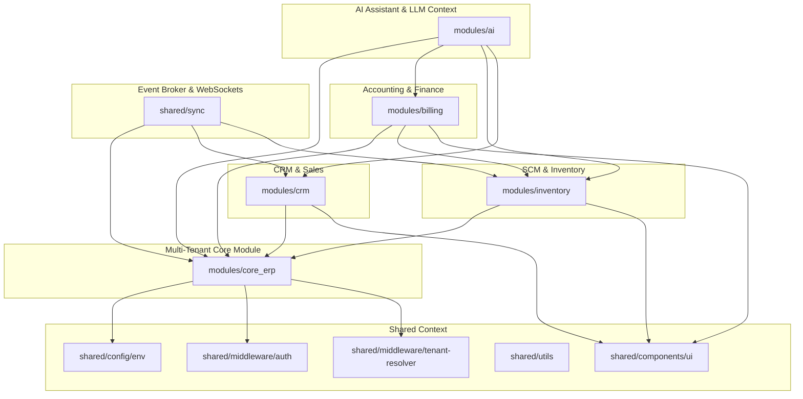

# Business Suite: Module Dependency Mapping & Architecture Graph
*Classification: Architectural Systems Engineering*  
*Target: System Architects, Platform Maintainers, and LLM Graph Routers*

---

## 1. System Overview & Dependency Rules

To prevent circular dependency locks, we enforce a strict **unidirectional architectural cascade**. Lower layers must remain completely unaware of higher layers, and higher modules can only depend on core infrastructure and shared resources.

---

## 2. Dynamic System Architecture Dependency Graph

The following Mermaid graph visualizes how modules interact within the Business Suite platform:

---

## 3. Module Dependencies Breakdown

Below is a detailed breakdown of each module's dependencies, imports, and interface endpoints.

### 3.1 Multi-Tenant Core (`modules/core_erp`)
*   **Purpose:** Tenant resolution, user registry, token provision, and database schema assignment.
*   **Internal Dependencies:**
    *   `src/shared/config/env.ts` (Dynamic Zod parsed environment variables).
    *   `src/shared/middleware/tenant-resolver.ts` (Router).
*   **External Dependencies:**
    *   `express` (Router / HTTP server).
    *   `@google/genai` (For initial company configuration).
    *   `drizzle-orm` (Relational routing mappings).

### 3.2 CRM & Sales Pipeline (`modules/crm`)
*   **Purpose:** Contact profiling, deals pipelines, and Kanban stage tracking.
*   **Internal Dependencies:**
    *   `modules/core_erp` (Requires user accounts and token authentication).
    *   `src/shared/components/ui/` (Shared dashboard elements).
*   **Forbidden Dependencies:**
    *   Cannot depend on `modules/billing` or `modules/ai` directly.

### 3.3 SCM & Warehousing (`modules/inventory`)
*   **Purpose:** SKU catalogs, tracking inventory balances, and processing transfers.
*   **Internal Dependencies:**
    *   `modules/core_erp` (For workspace management).
    *   `src/shared/components/ui/` (Shared visual cards and tables).
*   **Forbidden Dependencies:**
    *   Cannot depend on `modules/billing`.

### 3.4 Accounting & General Ledger (`modules/billing`)
*   **Purpose:** Bookkeeping, journal validations, invoicing, and processing payroll.
*   **Internal Dependencies:**
    *   `modules/core_erp` (For workspace credentials).
    *   `modules/inventory` (For inventory item billing and stock cost calculations).
*   **Forbidden Dependencies:**
    *   Cannot depend on `modules/ai` or `shared/sync` (must remain completely deterministic).

### 3.5 AI & Grounded Assistant (`modules/ai`)
*   **Purpose:** Gemini LLM processing, vector search index calculations, and automated task execution.
*   **Internal Dependencies:**
    *   `modules/core_erp` (For workspace profile metadata).
    *   `modules/crm` (For context parsing).
    *   `modules/inventory` (For catalogs queries).
    *   `modules/billing` (For historical reporting lookups).
*   **External Dependencies:**
    *   `@google/genai` (The core Gemini integration SDK).
    *   `pgvector` (Vector embedding queries).

### 3.6 Real-Time Synchronization & Sync Engine (`shared/sync`)
*   **Purpose:** Redis PubSub and WebSocket state synchronization across user sessions.
*   **Internal Dependencies:**
    *   `modules/core_erp` (For authenticated session validation).
    *   `modules/crm` (For deal update notices).
    *   `modules/inventory` (For live stock updates).
*   **External Dependencies:**
    *   `ws` (WebSockets).
    *   `ioredis` (Redis caching and event synchronization).
